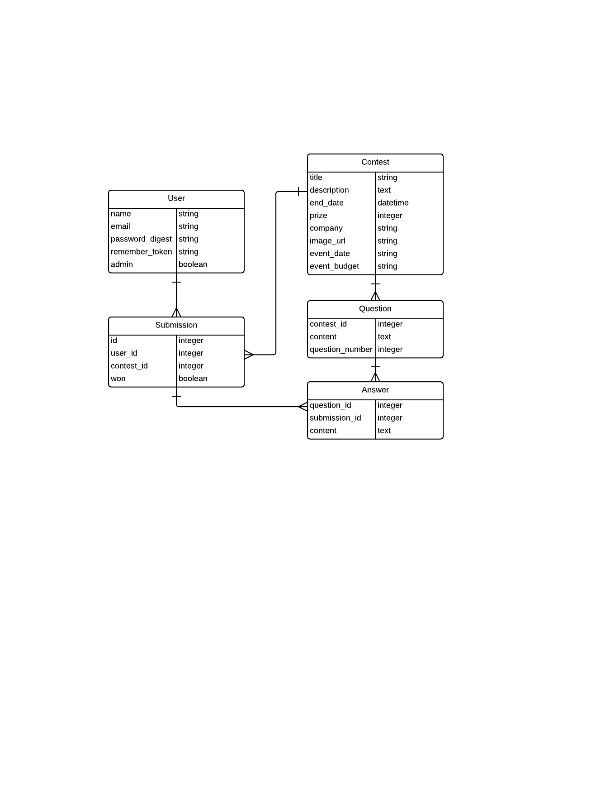

#KABOODLE

##General Assembly WDI Project 2, November 2014
 

##Overview

Kaboodle was created to fill the gap for businesses that can't afford a large PR firm...and for people interested in the PR space to get their start (recent grads, etc.), build a portfolio, and make money!

It is a web application that runs contests to generate crowd sourced ideas for PR & Marketing campaigns that businesses can immediately implement.

Kaboodle was developed for a project for the Fall 2014 Web Development Immersive course at General Assembly in Atlanta, GA by Ashley Tindell and Josh Kushner. It was developed over a week-long sprint to model the agile software development process.

##Technologies Used

* Ruby 2.1.2
* Rails 4.1.6
* [AngularJS](https://angularjs.org/)
* [Bootstrap 3.2.0](http://getbootstrap.com/)
* PostgreSQL Database
* Authentication & Authorization from scratch using [b-crypt-ruby](http://bcrypt-ruby.rubyforge.org/ "bcrypt-ruby")

##User Stories Completed

* As a user, I can log in as admin and see an extra option in navbar so they can choose winners of contests.
* As an admin, I can view submissions entered for each contest.
* As a user, I want to be greeted with a long page/homepage so that I can learn about Kaboodle!
* As a user, I can click on a contest so I can view specific details, current status, end date, and submission requirements
* As a user, I want to create an account so I can submit an entry into a contest
* As a user, I can sign in/up.
* As a user, I can answer specific questions related to the contest to form my very own marketing/PR plan.

##Production

Explore Kaboodle on Heroku [https://kaboodle.herokuapp.com/](https://kaboodle.herokuapp.com/)

##Backlog

A full list of user stories can be found on [this Trello Board](https://trello.com/b/jpSRIT8C). A mockup of the app is available [here](https://moqups.com/jkush33/LM3k6K1C/).

##ERD

Below is the ERD created for Kaboodle.

